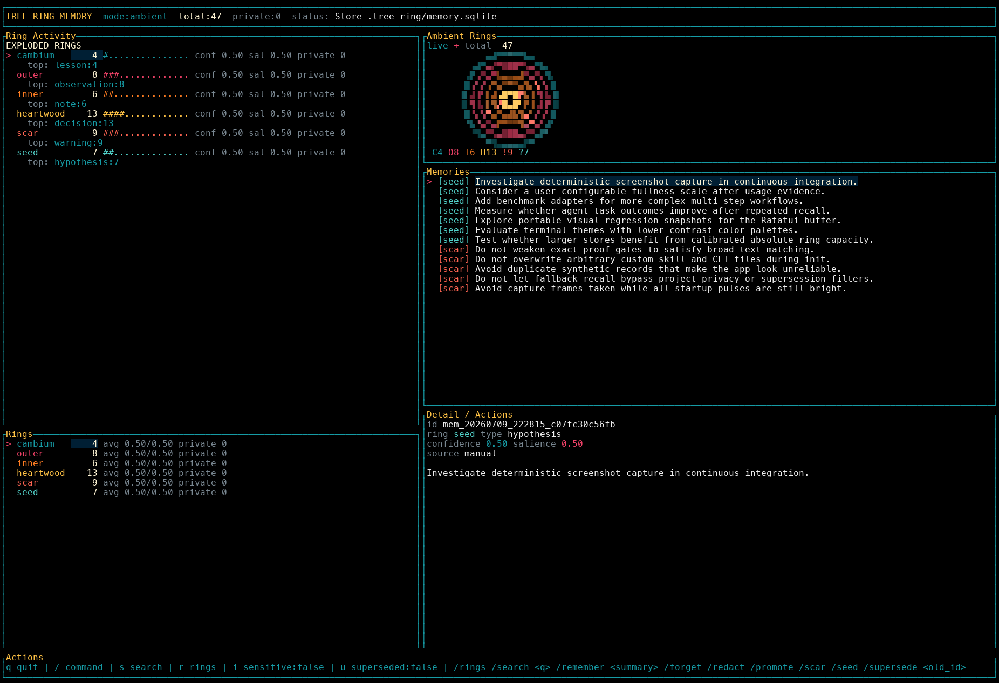
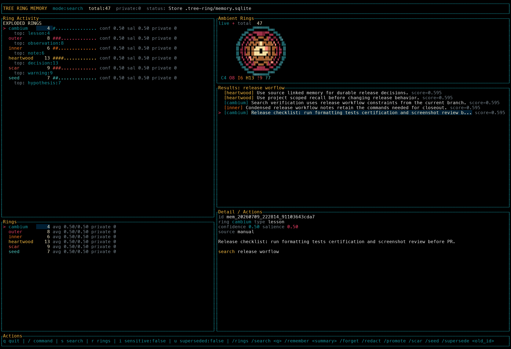
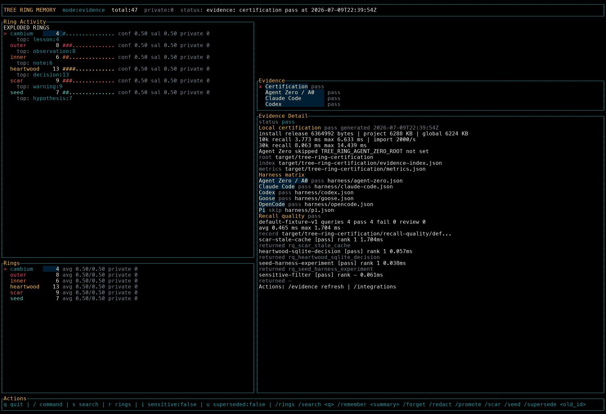
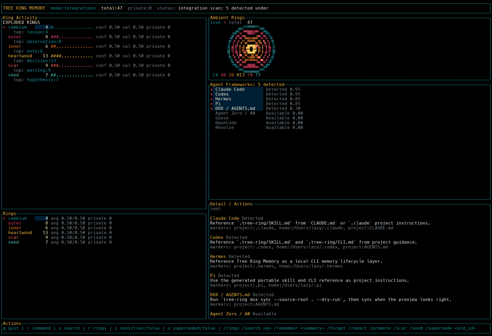

# Tree Ring Memory


Tree Ring Memory is a framework-agnostic, local-first memory lifecycle layer for
AI agents. It helps agents remember useful decisions, warnings, preferences,
and lessons without turning memory into a transcript dump. Fresh memory stays
detailed, older memory compresses into rings, important scars remain visible,
and durable truths become heartwood.

Tree Ring Memory is inspired by the spatial project-memory patterns in
[DOX](https://github.com/agent0ai/dox) and the evidence-driven improvement loop
in [Revolve](https://github.com/agent0ai/revolve), with a deliberate nod to
their original creator, [Jan Tomášek](https://github.com/frdel). This project is
framework-agnostic and does not replace either protocol.

Tree Ring Memory is in protocol-preview status. Current launch links:

- Launch page: <https://terminallylazy.github.io/Tree-Ring-Memory/>
- Launch release: <https://github.com/TerminallyLazy/Tree-Ring-Memory/releases/tag/v0.11.0>
- Launch discussion: <https://github.com/TerminallyLazy/Tree-Ring-Memory/discussions/27>
- Rust-native CLI article: <https://terminallylazy.github.io/Tree-Ring-Memory/launch/rust-native-agent-memory-cli.md>
- Feedback issue: <https://github.com/TerminallyLazy/Tree-Ring-Memory/issues/26>
- Homebrew tap: <https://github.com/TerminallyLazy/homebrew-tree-ring>

<details>
<summary>Protocol preview history</summary>

- v0.1 provided the initial local reference implementation with SQLite storage and no required cloud services.
- v0.2 moved durable behavior into a Rust core.
- v0.3 explored host bindings during the Rust migration.
- v0.4 added Rust-owned JSONL import/export with privacy-preserving defaults across the CLI.
- v0.5 added Rust-owned audit checks for stale, sensitive, low-confidence, supersession, and contradiction candidates.
- v0.6 added Rust-owned deterministic consolidation with idempotent summary records and cautious sensitive-memory handling.
- v0.7 made the public facade Rust-native only and added Rust-owned maintenance for expiry, secret redaction, and FTS repair.
- v0.8 removed Python-owned runtime behavior.
- v0.9 removed tracked Python source, tests, smoke scripts, and the optional CPython extension from the canonical repo.
- v0.10 added a one-line installer plus Rust-native terminal onboarding with animated terminal tree rings.
- v0.11 made the repo fully Rust-native, wired TUI export/consolidation actions, added DOX/Revolve sync adapters, and added agent-framework discovery.

</details>

## What It Gives Agents

- Explicit local recall with SQLite/FTS storage and no required cloud service.
- Source-linked memories for decisions, scars, lessons, evidence, and durable
  project truths.
- Rust-native import/export, audit, consolidation, maintenance, DOX/Revolve
  adapters, harness discovery, and terminal UI.
- Evidence artifacts for install size, recall speed, harness readiness, and
  recall quality.
- Privacy defaults that block secret-like memory, hide sensitive details, and
  keep transcript capture out of scope.

The Rust workspace currently includes:

- `crates/tree-ring-memory-core`: models, validation, sensitivity checks, and recall scoring.
- `crates/tree-ring-memory-sqlite`: schema-compatible SQLite/FTS storage and recall filtering.
- `crates/tree-ring-memory-cli`: native `tree-ring` CLI.

The public runtime is Rust-native. The Rust CLI and Rust crates own storage,
recall, import/export, audit, consolidation, maintenance, and terminal UI
behavior. There is no tracked root Python package, Python wrapper layer, pytest
suite, Python smoke script, PyO3 crate, or CPython extension.

## Screenshots

These are captured from the actual `tree-ring tui` app running against a local
`.tree-ring` store populated through the public CLI with 47 memories across
all rings, plus the current certification artifacts.



Dashboard view with populated cambium, outer, inner, heartwood, scar, and seed
rings. Ambient layers are duller at lower relative fullness and lighter as their
share of stored memories grows; activity pulses are temporary.



Search mode with ranked recall results and selected-memory details.



Evidence browser with install size, recall speed, harness records, and
recall-quality checks loaded from `target/tree-ring-certification/`.



Integrations view showing detected local agent framework markers and next-step
guidance.

## Quick Start

Global user install:

```bash
curl -fsSL https://raw.githubusercontent.com/TerminallyLazy/Tree-Ring-Memory/main/install.sh | sh
```

macOS ARM64 install with Homebrew:

```bash
brew tap TerminallyLazy/tree-ring
brew install tree-ring
```

Project-local install with first-run initialization:

```bash
curl -fsSL https://raw.githubusercontent.com/TerminallyLazy/Tree-Ring-Memory/main/install.sh | sh -s -- --project --init
```

Store the first project memory:

```bash
tree-ring init
tree-ring remember "Use project-scoped recall before changing release behavior." \
  --event-type lesson \
  --scope project \
  --project example-service \
  --tag release \
  --tag workflow
tree-ring recall "release behavior" --project example-service
```

Open the terminal console:

```bash
tree-ring tui
```

## Install Details

The installer builds the Rust CLI with `cargo`, installs `tree-ring`, then shows
one stable terminal onboarding screen with a branded terminal ring and the next
useful commands. For global installs, it also adds the install bin directory to your
shell profile when that directory is not already on `PATH`. It does not
initialize memory unless `--init` is passed.

The installer command streams only the installer script into `sh`. It does not
put memory in a temporary location and it does not remove `.tree-ring`,
installed binaries, Cargo caches, source checkouts, or shell profiles.
Persistent memory lives in the configured memory root, normally `.tree-ring`
for project-local use or whatever path you pass with `--root`.

Initialization creates the SQLite store and non-destructive agent-awareness
files in the memory root:

- `.tree-ring/AGENTS.md`: DOX-style Tree Ring Memory guidance and root
  `AGENTS.md` merge notes.
- `.tree-ring/SKILL.md`: portable skill instructions for agent runtimes.
- `.tree-ring/CLI.md`: quick command reference for recall, remember, evidence,
  DOX/Revolve sync, import/export, audit, maintenance, and TUI usage.

Existing awareness files are left untouched. Tree Ring Memory does not modify a
project's root `AGENTS.md`; merge the generated guidance manually when you want
DOX-aware agents to see it before entering `.tree-ring/`.

Useful installer options:

```bash
sh install.sh --help
sh install.sh --project --init
sh install.sh --global --install-dir "$HOME/.local"
sh install.sh --no-animation  # stable output; kept for explicit script usage
sh install.sh --no-path-update
sh install.sh --archive-url https://example/tree-ring-memory-0.11.0-macos-arm64.tar.gz --archive-sha256 <sha256>
```

After install, rerun onboarding anytime:

```bash
tree-ring welcome
tree-ring welcome --init
tree-ring
```

By default, the installer uses `cargo install` from the Git repository or a
local `--source` checkout. Release builds can use `--archive-url` plus
`--archive-sha256` to install a prebuilt `tree-ring` binary archive.

Open the terminal console after a global install:

```bash
tree-ring tui
```

If your shell cannot find `tree-ring` after a global install, run it directly or
add the install bin directory to the current terminal. The installer can update
future shell sessions through your shell profile, but a child installer process
cannot rewrite the already-running parent shell environment:

```bash
$HOME/.local/bin/tree-ring tui
export PATH="$HOME/.local/bin:$PATH"
```

Open the terminal console after a project-local install:

```bash
.tree-ring/bin/tree-ring --root .tree-ring tui
```

## CLI Preview

The `tree-ring` command is the Rust CLI.

```bash
tree-ring init
tree-ring remember "Use protocol-first design." --event-type decision --tag architecture
tree-ring evidence "Snapshot invalidation fixed stale unread chat state." --outcome promoted --evidence-ref evals/chat-state/run-042 --score 0.91
tree-ring recall "protocol design"
tree-ring forget mem_example --mode delete --reason "example cleanup"
tree-ring export --output memories.jsonl
tree-ring import memories.jsonl --dry-run
tree-ring import memories.jsonl
tree-ring audit --audit-type sensitive
tree-ring consolidate --period-type manual --dry-run
tree-ring maintain
tree-ring maintain --apply-expired --repair-fts
tree-ring dox sync --source-root . --dry-run
tree-ring revolve sync --source-root revolve --dry-run
tree-ring integrations scan --source-root .
```

The CLI stores memory in `.tree-ring/` by default.

Command ownership is Rust-native:

- `init` creates the SQLite store plus `.tree-ring/AGENTS.md`, `.tree-ring/SKILL.md`, and `.tree-ring/CLI.md` without overwriting existing files.
- `remember`, `recall`, and `forget` cover direct memory capture, retrieval, redaction, and deletion.
- `evidence` is the Revolve-inspired improvement-loop entry point for evaluated outcomes.
- `dox sync` and `revolve sync` are read-only source adapters that summarize and point back to authoritative files.
- `integrations scan` discovers nearby agent-framework markers and suggests setup paths without changing their config.
- `export`, `import`, `audit`, `consolidate`, and `maintain` are local maintenance surfaces over the same SQLite store.
- `welcome` and `tui` are the terminal onboarding and operator-console surfaces.

## Evidence Loop

The Revolve-inspired loop is exposed through `tree-ring evidence`. It records
evaluated outcomes as memory with an evidence reference instead of treating
claims as durable truth without support.

```bash
tree-ring evidence "Snapshot invalidation fixed stale unread chat state." \
  --outcome promoted \
  --evidence-ref evals/chat-state/run-042 \
  --project agent-ui \
  --score 0.91

tree-ring evidence "Aggressive caching caused stale multi-chat state." \
  --outcome rejected \
  --evidence-ref evals/cache-branch/run-013 \
  --project agent-ui
```

Outcome mapping:

- `promoted` -> `heartwood`, durable `evaluation_promotion`
- `rejected` -> `scar`, durable `evaluation_rejection`
- `deferred` -> `seed`, `evaluation_hypothesis`
- `observed` -> `outer`, `evaluation_result`

This is not a replacement for Revolve records. Use source refs that point back
to real evaluations, checkpoints, PRs, issues, logs, or run artifacts.

## Source Adapters

Tree Ring Memory includes Rust-native source adapters. They produce concise,
source-linked memory events and then persist through the same SQLite store as
manual memories.

```bash
tree-ring dox sync --source-root . --dry-run
tree-ring dox sync --source-root . --project example-service

tree-ring revolve sync --source-root revolve --dry-run
tree-ring revolve sync --source-root revolve --project example-service
```

DOX sync discovers `AGENTS.md` files, stores summaries and source refs, and
keeps the source files authoritative. It can scan a project root or a single
`AGENTS.md` file. It does not copy entire project-contract trees into memory,
does not weaken child contracts, and does not let memory replace fresh DOX
traversal before edits.

Revolve sync scans a Revolve root or an evidence file. It imports promoted
outcomes as heartwood, rejected outcomes as scars, deferred hypotheses as
seeds, and observed results as outer-ring evidence. It keeps source refs back
to the Revolve/evaluation record and does not treat incomparable or
outcome-free files as durable truth.

For both adapters, run `--dry-run` first. Imported memory is a concise recall
aid; the source `AGENTS.md`, Revolve record, evaluation artifact, PR, issue,
test, or run log remains authoritative.

Framework discovery is read-only:

```bash
tree-ring integrations scan --source-root .
tree-ring integrations certify --source-root .
```

- `integrations certify` writes non-mutating harness evidence under
  `target/tree-ring-certification/harness/` and updates
  `target/tree-ring-certification/evidence-index.json`. Pass, fail, and skip
  states are evidence records, not broad compatibility claims.
- `recall-quality` writes non-private recall diagnostics under
  `target/tree-ring-certification/recall-quality/default-fixture-v1.json`
  and merges the result into
  `target/tree-ring-certification/evidence-index.json`. It uses deterministic
  safe fixture memories, records returned ids, rank positions, score factors,
  and latency, and marks each query as `pass`, `fail`, or `needs_review`.

```bash
tree-ring recall-quality --source-root .
```

It looks for local markers for DOX, Revolve, Codex, Claude Code, Agent Zero/A0,
Goose, OpenCode, Hermes, and Pi, then suggests next steps without editing those
tools' configuration. JSON output records whether each marker came from the
project or from the user's home configuration, so harness readiness is not
overstated when only global config exists.

Agent-mediated bridge linking is the planned next step after read-only
discovery. The design keeps `.tree-ring` as the canonical memory root while
adding small project-level bridge files that tell the active agent to read
`.tree-ring/SKILL.md` and `.tree-ring/CLI.md`. Project bridges are preferred
because they travel with the repo; global bridges affect every project and must
remain explicit opt-in. Until `tree-ring integrations link` is implemented, add
those references manually in the harness startup context or project instruction
file instead of expecting `tree-ring init` to modify Codex, Claude, Pi,
OpenCode, or other agent configuration.

`tree-ring export` writes newline-delimited JSON. The first line is a
`tree_ring_memory_export` header with schema and plugin version metadata; each
remaining line is a `memory_event` envelope. The command excludes sensitive and
superseded memories unless `--include-sensitive` or `--include-superseded` is
set. Import validates all events, batches writes through SQLite, skips duplicate
ids by default, and replaces existing ids only with `--replace-existing`.

`tree-ring audit` is non-mutating. It reports deterministic local findings for
stale expiry, sensitive retention, low-confidence durable memory, supersession
integrity, and conservative contradiction candidates.

`tree-ring consolidate` creates deterministic local summary memories without an
LLM. Dry-run mode writes nothing. Persisted consolidation is idempotent for the
same period and source-memory set unless `--force` is provided. Sensitive
non-secret memories are summarized without copying raw payload text and require
review; secret-like memories are excluded from consolidation.

`tree-ring maintain` is safe by default. Without apply flags it is a dry-run
report, including on a missing root. It can apply eligible temporary-memory
expiry, redact secret-like memories, and rebuild SQLite FTS only when explicitly
asked through `--apply-expired`, `--apply-secret-redactions`, or `--repair-fts`.

## Terminal Console Preview

The Rust CLI includes a framework-agnostic Ratatui console for humans and agent
operators working from a terminal:

```bash
tree-ring tui
tree-ring --root .tree-ring tui --event-stream ./tree-ring-events.jsonl --tick-ms 150
```

From a source checkout without installing:

```bash
cargo run -p tree-ring-memory-cli -- --root .tree-ring welcome --init --no-animation
cargo run -p tree-ring-memory-cli -- --root .tree-ring remember "Try the TUI with a first memory." --event-type lesson --scope project
cargo run -p tree-ring-memory-cli -- --root .tree-ring tui
```

The console keeps an animated straight-on tree-ring face visible at all times.
The visual layer generates a backend-independent ring frame first, then rasterizes
that frame into high-resolution terminal cells for the ambient HUD. Individual
rings carry clockwise or counter-clockwise highlights, pulse with matching memory
activity, and shimmer through scar marks on each tick. That keeps the always-on
animation cheap and portable while leaving room for richer Kitty/iTerm2
image-protocol rendering in welcome or expanded views later.
Store-watch polling updates persisted counts from SQLite, while the optional
event stream lights rings in real time without treating stream events as durable
truth.

Useful keys and commands:

- `s` focuses search, `/` opens the slash command palette, `r` opens exploded
  ring view, `q` quits.
- `i` toggles sensitive-memory visibility, `u` toggles superseded-memory
  visibility.
- Slash commands include `/rings`, `/search <query>`, `/remember <summary>`,
  `/forget`, `/redact`, `/promote`, `/scar`, `/seed`, `/supersede <old_id>`,
  `/consolidate`, `/export <file>`, `/sync`, `/integrations`, `/stream`, and
  `/watch`.

Destructive or authority-changing operations are confirmation-gated. Sensitive
details stay hidden by default, and secret-like memory is blocked before
storage.

Event stream lines are local JSONL objects. They are display signals only:

```json
{"event":"remembered","ring":"cambium","label":"Stored project lesson"}
{"event":"policy_blocked","ring":"scar","label":"Secret-like memory blocked"}
```

## Development Checks

```bash
cargo test --locked
sh install.sh --help
cargo run -p tree-ring-memory-cli -- --help
cargo run -p tree-ring-memory-cli -- welcome --no-animation
cargo run -p tree-ring-memory-cli -- tui --help
cargo run -p tree-ring-memory-cli -- export --help
cargo run -p tree-ring-memory-cli -- import --help
cargo run -p tree-ring-memory-cli -- audit --help
cargo run -p tree-ring-memory-cli -- consolidate --help
cargo run -p tree-ring-memory-cli -- maintain --help
cargo run -p tree-ring-memory-cli -- dox sync --help
cargo run -p tree-ring-memory-cli -- revolve sync --help
cargo run -p tree-ring-memory-cli -- integrations scan --help
cargo run --release -p tree-ring-memory-sqlite --example performance_smoke -- 1000
sh scripts/certify-tree-ring.sh
sh scripts/package-release.sh
```

The Rust CLI writes the canonical SQLite/raw JSON shape. The performance smoke
asserts nonempty recalls, emits a `METRICS_JSON=` line, and uses conservative
local thresholds of at least 500 inserts/sec and max recall latency of 250 ms
for the synthetic workload.

`scripts/certify-tree-ring.sh` runs the fuller local certification suite:
formatting, tests, Clippy, release build, isolated project/global installs, CLI
JSON smokes, DOX/Revolve adapter smokes, integration-scan origin checks,
install-size, recall-speed, recall-quality diagnostics, CLI, adapter, and
harness checks, import throughput, and 10k/30k recall timing. It writes
`target/tree-ring-certification/summary.md`,
`target/tree-ring-certification/metrics.json`, and
`target/tree-ring-certification/evidence-index.json`.

Most recent branch-local certification run, generated at
`2026-07-09T15:34:52Z`:

- Release binary: 6,352,528 bytes.
- Project install with init: 6,272 KB.
- Global install: 6,228 KB.
- CLI import: 10,000 memories in 5 seconds, about 2,000/sec.
- 10k recall: 3.643 ms average, 6.499 ms max.
- 30k recall: 7.608 ms average, 13.634 ms max.
- Harness matrix: 5 pass, 1 skip. Codex, Claude Code, OpenCode, Goose, and
  Agent Zero/A0 passed; Pi was skipped because only a user-home marker was
  present in the fixture.
- Recall quality: 4 queries, 4 pass, 0 fail, 0 needs review; average latency
  0.118 ms, max latency 0.370 ms.
- Agent Zero plugin smoke: skipped because `TREE_RING_AGENT_ZERO_ROOT` was not
  set.

Certification also runs the default memory quality scenario pack under
`fixtures/quality/`. Those scenarios prove recall gates, spam rejection,
stale-truth suppression, evidence requirements, and behavior-proof outcomes.
The quality report is written to
`target/tree-ring-certification/quality/quality-report.json` with a readable
summary at `target/tree-ring-certification/quality/quality-summary.md`.

`scripts/package-release.sh` builds the Rust CLI in release mode, creates a
platform tarball under `dist/`, and writes a SHA-256 checksum file. Tag pushes
run the release artifact workflow for Linux and macOS.

## Design Docs

- `docs/architecture/rust-core-roadmap.md`
- `docs/architecture/rust-core-status.md`
- `docs/integrations/agent-skill.md`
- `docs/protocol/memory-event.md`

Historical migration and planning documents are retained under `docs/superpowers/`
and `docs/feature/`. Some of those records describe earlier Python prototype or
binding options that have since been superseded by the Rust-native runtime.
The current bridge-linking design is tracked in
`docs/superpowers/specs/2026-07-06-tree-ring-agent-mediated-bridges-design.md`.

## Agent Workflow Integration

- `skills/tree-ring-memory/SKILL.md` gives agents portable guidance for when to recall, remember, redact, forget, or avoid memory capture.
- `templates/dox/AGENTS.md` is a DOX-style project contract template for repos that want Tree Ring Memory rules alongside source code.
- `docs/integrations/agent-skill.md` explains how to use both without making memory more authoritative than local project docs.
- `tree-ring init` and `tree-ring welcome --init` copy local guidance into `.tree-ring/AGENTS.md`, `.tree-ring/SKILL.md`, and `.tree-ring/CLI.md` without overwriting existing files.

For DOX-style project awareness, merge the relevant generated `.tree-ring/AGENTS.md`
sections into the project root `AGENTS.md`. The CLI intentionally does not
rewrite root project contracts automatically.

For agent harnesses that support local skills or instruction packs, point them
at `.tree-ring/SKILL.md` or the repository copy under `skills/`. For
DOX-aware agents, make sure the project root `AGENTS.md` tells the agent to read
Tree Ring Memory guidance when memory is initialized. For CLI-driven agents,
include `.tree-ring/CLI.md` in the harness prompt or startup context so the
agent knows the exact local commands.

Bridge files should be short discovery pointers, not duplicate memory stores.
Recommended project-level bridge targets are `.agents/skills/tree-ring-memory/SKILL.md`
for Codex/Gemini-style skill loaders, `.claude/skills/tree-ring-memory/SKILL.md`
plus `CLAUDE.md` references for Claude Code, root `AGENTS.md` references for
OpenCode/DOX-style agents, and `.pi/settings.json` resource references for Pi.
Global bridge files under home directories are useful only when the user wants
Tree Ring visible in every project.

Memory updates are agent-mediated. Bridge files tell the active agent when to
call `tree-ring recall`, `tree-ring remember`, `tree-ring evidence`,
`tree-ring forget`, `tree-ring consolidate --dry-run`, or `tree-ring maintain`.
Tree Ring does not scrape transcripts, run a hidden recorder, or turn TUI
event-stream pulses into durable memory without an explicit write command.

## Brand Assets

- `assets/tree-ring-memory-logo.png`
- `assets/tree-ring-memory-banner.png`

## Principles

- Local-first by default.
- Protocol before adapters.
- Explainable recall.
- Sensitive data fails closed.
- Forgetting and supersession are first-class.
- Memory quality should be testable.
